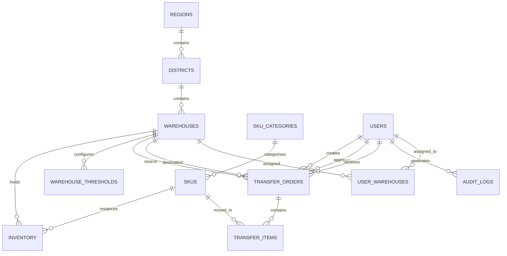

# NADMO-WMS Architecture Document

**System Architecture — Version 1.0**

*Classification: Confidential — For Government Review*  
*Date: June 2026*  
*Prepared for: National Disaster Management Organisation (NADMO), Republic of Ghana*

---

## 1. Introduction

This document defines the technical architecture for the **NADMO Integrated Warehouse & Logistics Management System (NADMO-WMS)**. It describes the system's structure, components, data model, interfaces, security model, and deployment strategy. The architecture is designed to support the requirements defined in the NADMO-WMS Product Requirements Document (PRD) v2.0.

### 1.1 Goals

- Provide a **single source of truth** for all NADMO warehouse stock and logistics operations.
- Enable **real-time visibility** across HQ, regional, and district warehouses.
- Ensure **security, auditability, and compliance** with Ghanaian government standards.
- Be **deployable quickly** on managed cloud services while remaining **portable to sovereign hosting**.
- Support **low-bandwidth and intermittent connectivity** environments.

### 1.2 Scope

This architecture covers the MVP release, which includes:

- Web application (PWA) for HQ, regional, district, and field users
- Supabase backend (PostgreSQL, Auth, Realtime, Edge Functions, Storage)
- Core modules: auth, dashboards, inventory, transfers, waybills, alerts, audit trail, national map
- Integration with Arkesel SMS, OpenStreetMap/GhanaPost GPS
- Deployment on Vercel + Supabase Cloud with migration path to GovTech Ghana infrastructure

---

## 2. Architectural Principles

| Principle | Description |
|-----------|-------------|
| **Security by Design** | Defence in depth: every layer enforces authentication, authorisation, and audit. |
| **Data Sovereignty** | Architecture is cloud-portable; no vendor lock-in; full data export at any time. |
| **Offline-First Readiness** | PWA service workers cache UI and queue mutations; native mobile app planned for Phase 2. |
| **Least Privilege** | Users see only data and actions permitted by their role, enforced at the database level. |
| **Event-Driven Visibility** | Real-time subscriptions propagate stock changes, transfers, and alerts instantly. |
| **Audit Everything** | Every create, update, delete, export, login, and approval is logged immutably. |
| **Humanitarian-Grade UX** | Interface is optimised for crisis use: clear, fast, and usable on low-cost tablets. |

---

## 3. System Context

```
┌─────────────────────────────────────────────────────────────────────────────────────────┐
│                                    EXTERNAL ACTORS                                       │
│  ┌──────────────┐  ┌──────────────┐  ┌──────────────┐  ┌──────────────┐  ┌───────────┐  │
│  │   Director   │  │   Regional   │  │   District   │  │    Field     │  │  Auditor  │  │
│  │   General    │  │   Manager    │  │   Officer    │  │   Officer    │  │           │  │
│  └──────┬───────┘  └──────┬───────┘  └──────┬───────┘  └──────┬───────┘  └─────┬─────┘  │
│         │                  │                  │                  │                │       │
└─────────┼──────────────────┼──────────────────┼──────────────────┼────────────────┼───────┘
          │                  │                  │                  │                │
          └──────────────────┴──────────────────┴──────────────────┴────────────────┘
                                            │
                                            ▼ HTTPS
┌─────────────────────────────────────────────────────────────────────────────────────────┐
│                                     NADMO-WMS PLATFORM                                     │
│  ┌─────────────────────────────────────────────────────────────────────────────────────┐  │
│  │                              Next.js Web Application (PWA)                           │  │
│  │  Dashboards │ Inventory │ Transfers │ Waybills │ Alerts │ Audit │ Reports │ Map     │  │
│  └────────────────────────────────────────────────┬────────────────────────────────────┘  │
│                                                   │ API / Realtime                         │
│                                                   ▼                                        │
│  ┌─────────────────────────────────────────────────────────────────────────────────────┐  │
│  │                              Supabase Backend                                        │  │
│  │  Auth │ PostgreSQL + RLS │ Realtime │ Edge Functions │ Storage │ Vector/Analytics    │  │
│  └─────────────────────────────────────────────────────────────────────────────────────┘  │
└─────────────────────────────────────────────────────────────────────────────────────────┘
                                            │
          ┌─────────────────────────────────┼─────────────────────────────────┐
          ▼                                 ▼                                 ▼
┌─────────────────────┐         ┌─────────────────────┐         ┌─────────────────────┐
│  Arkesel SMS        │         │  OpenStreetMap /    │         │  GhanaPost GPS      │
│  (Notifications)    │         │  Mapbox (Maps)      │         │  (Location Codes)   │
└─────────────────────┘         └─────────────────────┘         └─────────────────────┘
```

---

## 4. Container Architecture

```
┌─────────────────────────────────────────────────────────────────────────────────────────┐
│                                     CLIENT DEVICES                                       │
│  ┌────────────┐  ┌────────────┐  ┌────────────┐  ┌────────────┐                        │
│  │   Desktop  │  │   Tablet   │  │   Mobile   │  │   Kiosk    │                        │
│  │  (HQ/RM)   │  │ (District) │  │  (Field)   │  │ (Warehouse)│                        │
│  └─────┬──────┘  └─────┬──────┘  └─────┬──────┘  └─────┬──────┘                        │
│        └─────────────────┴─────────────────┴─────────────────┘                          │
│                              Next.js 14 PWA (React + TypeScript)                         │
│                              Tailwind CSS + shadcn/ui                                    │
└─────────────────────────────────────────────────────────────────────────────────────────┘
                                            │
                                            ▼ TLS 1.3
┌─────────────────────────────────────────────────────────────────────────────────────────┐
│                                     EDGE / CDN                                           │
│                         Vercel Edge Network (Static Assets, Caching)                     │
└─────────────────────────────────────────────────────────────────────────────────────────┘
                                            │
                                            ▼
┌─────────────────────────────────────────────────────────────────────────────────────────┐
│                                APPLICATION LAYER                                         │
│  ┌────────────────────┐  ┌────────────────────┐  ┌────────────────────┐                 │
│  │   Next.js App      │  │   Supabase Edge    │  │   Next.js API      │                 │
│  │   Router (SSR/CSR) │  │   Functions (Deno) │  │   Routes (optional)│                 │
│  └────────────────────┘  └────────────────────┘  └────────────────────┘                 │
└─────────────────────────────────────────────────────────────────────────────────────────┘
                                            │
                                            ▼
┌─────────────────────────────────────────────────────────────────────────────────────────┐
│                                  DATA LAYER                                              │
│  ┌──────────────┐  ┌──────────────┐  ┌──────────────┐  ┌──────────────┐  ┌──────────┐  │
│  │  PostgreSQL  │  │  Supabase    │  │  Redis       │  │  Object      │  │  Audit   │  │
│  │  (Primary DB)│  │  Realtime    │  │  (Cache)     │  │  Storage     │  │  Log     │  │
│  └──────────────┘  └──────────────┘  └──────────────┘  └──────────────┘  │  Store   │  │
│  ┌──────────────┐  ┌──────────────┐  ┌──────────────┐                     └──────────┘  │
│  │  TimescaleDB │  │  PostgREST   │  │  GoTrue      │                                     │
│  │  (optional)  │  │  (Auto API)  │  │  (Auth)      │                                     │
│  └──────────────┘  └──────────────┘  └──────────────┘                                     │
└─────────────────────────────────────────────────────────────────────────────────────────┘
```

---

## 5. Component Architecture

### 5.1 Frontend Components

```
app/
├── (auth)/                    # Authentication group
│   ├── login/page.tsx
│   ├── mfa/page.tsx
│   └── reset-password/page.tsx
├── (dashboard)/               # Dashboard group
│   ├── layout.tsx             # Role-aware shell
│   ├── page.tsx               # National dashboard (HQ)
│   ├── region/[id]/page.tsx   # Regional dashboard
│   ├── district/[id]/page.tsx # District dashboard
│   ├── inventory/page.tsx
│   ├── transfers/page.tsx
│   ├── transfers/[id]/page.tsx
│   ├── alerts/page.tsx
│   ├── audit/page.tsx
│   └── reports/page.tsx
├── api/                       # Next.js API routes (if needed)
└── layout.tsx

components/
├── ui/                        # shadcn/ui components
├── layout/                    # Sidebar, topbar, shell
├── dashboard/                 # KPI cards, maps, charts
├── inventory/                 # Intake, dispatch, adjustment forms
├── transfers/                 # Transfer form, timeline, waybill
├── alerts/                    # Alert cards, notification centre
├── audit/                     # Audit log table
├── map/                       # Ghana map components
└── forms/                     # Reusable form components

lib/
├── supabase/                  # Supabase clients (browser/server)
├── auth/                      # Auth helpers and middleware
├── hooks/                     # Custom React hooks
├── utils/                     # Utility functions
└── constants/                 # App constants

types/
└── index.ts                   # Shared TypeScript types

supabase/
├── migrations/                # Database migrations
├── functions/                 # Edge Functions
├── policies/                  # RLS policies (in migrations)
└── seed.sql                   # Seed data
```

### 5.2 Backend Components

| Component | Technology | Responsibility |
|-----------|------------|----------------|
| Authentication | Supabase Auth (GoTrue) | User management, JWT, MFA, password policies |
| Database | PostgreSQL 15+ | All transactional data, RLS, triggers |
| Realtime | Supabase Realtime | Live dashboard updates, alert propagation |
| Storage | Supabase Storage | Waybill PDFs, signatures, photos, imports |
| Edge Functions | Deno (Supabase) | SMS, PDF generation, complex validation |
| Cache | Redis / Upstash | Sessions, dashboard cache, rate limiting |
| Queue | pg-boss / Edge Functions | Background jobs (SMS retries, reports) |

---

## 6. Technology Stack

| Layer | Technology | Justification |
|-------|------------|---------------|
| **Frontend Framework** | Next.js 14+ (App Router) | PWA support, SSR/SSG, React Server Components, edge deployment |
| **Language** | TypeScript 5+ | Type safety, better DX, fewer runtime errors |
| **Styling** | Tailwind CSS 3.4+ | Utility-first, rapid development, small bundle |
| **UI Components** | shadcn/ui + Radix UI | Accessible, customisable, government-grade |
| **State Management** | TanStack Query + Zustand | Server-state caching + lightweight client state |
| **Forms** | React Hook Form + Zod | Type-safe forms and validation |
| **Backend Platform** | Supabase | Open-source, self-hostable, integrated auth/database/realtime |
| **Database** | PostgreSQL 15+ | ACID, geospatial (PostGIS), JSON, mature |
| **Auth** | Supabase Auth + TOTP | Secure, MFA-ready, JWT-based |
| **Maps** | Leaflet.js + OpenStreetMap | Free, open, offline-capable |
| **PDF** | @react-pdf/renderer (Edge Function) | Server-side PDF generation |
| **SMS** | Arkesel API | Ghana-local, branded sender ID |
| **Monitoring** | Sentry + Vercel Analytics | Error tracking, performance monitoring |
| **CI/CD** | GitHub Actions | Automated test, lint, build, deploy |
| **Hosting** | Vercel + Supabase Cloud | Fastest path to MVP; portable to sovereign hosting |

---

## 7. Data Model

### 7.1 Entity Relationship Diagram (Mermaid)



### 7.2 Core Tables

See PRD v2.0 Section 13 for full field specifications. Key tables:

- `regions`, `districts`, `warehouses`
- `sku_categories`, `skus`
- `inventory` (with batch/lot and expiry)
- `warehouse_thresholds`
- `users` (extended profile), `user_warehouses`
- `transfer_orders`, `transfer_items`
- `audit_logs`
- `notifications`
- `gps_tracking` (future)

### 7.3 Key Design Decisions

1. **Inventory Model**: Use `inventory` table with batch/lot granularity. `available_quantity` is computed as `quantity - reserved_quantity`.
2. **Transfer Reservation**: When a transfer is approved, stock is reserved (not yet deducted). Deduction happens at dispatch; receipt updates destination inventory.
3. **Audit Log**: Append-only table with hash chain for tamper evidence.
4. **Notifications**: Decoupled from transactions via triggers/edge functions to avoid blocking UI.

---

## 8. API Design

### 8.1 API Layers

| Layer | Type | Use Case |
|-------|------|----------|
| Auto-generated REST | PostgREST | CRUD operations with RLS |
| Realtime | Supabase Realtime | Live updates |
| Edge Functions | Deno | Business logic, integrations, PDFs |
| Next.js API Routes | Node.js | Server-side rendering helpers (optional) |

### 8.2 Edge Functions

| Function | Method | Purpose |
|----------|--------|---------|
| `create-transfer` | POST | Validate stock, route approval, reserve inventory |
| `approve-transfer` | POST | Approve/reject, update status, notify |
| `receive-transfer` | POST | Confirm receipt, update stock, handle discrepancies |
| `generate-waybill` | GET/POST | Generate PDF waybill with QR code |
| `send-sms` | POST | Send SMS via Arkesel |
| `check-alerts` | POST | Evaluate threshold breaches |
| `bulk-import` | POST | Validate and import CSV/Excel data |

### 8.3 Realtime Channels

| Channel | Events | Consumers |
|---------|--------|-----------|
| `public:transfer_orders` | INSERT/UPDATE | Dashboards, transfer lists |
| `public:inventory` | UPDATE | Stock tables, alerts |
| `public:alerts` | INSERT | Alert panels, notification centre |
| `public:gps_tracking` | INSERT | Map vehicle layer |

---

## 9. Security Architecture

### 9.1 Authentication

- **Primary**: Email/password via Supabase Auth
- **MFA**: TOTP required for HQ, Regional, Auditor roles; optional for District
- **Session**: Short-lived JWT (15 min) + rotating refresh token
- **Password Policy**: Min 12 chars, complexity, 90-day expiry, history

### 9.2 Authorisation

- **Application-level**: Middleware checks role and permission
- **Database-level**: Row-Level Security (RLS) policies enforce data access
- **API-level**: Edge Functions validate permissions before acting

### 9.3 Defence in Depth

```
┌─────────────────────────────────────────┐
│  1. Perimeter: TLS 1.3, WAF, CDN        │
├─────────────────────────────────────────┤
│  2. App: AuthN/AuthZ, MFA, validation   │
├─────────────────────────────────────────┤
│  3. Data: AES-256 at rest, RLS, backups │
├─────────────────────────────────────────┤
│  4. Network: Private DB, IP allowlist   │
├─────────────────────────────────────────┤
│  5. Audit: Immutable logs, monitoring   │
├─────────────────────────────────────────┤
│  6. Ops: Secrets mgmt, least privilege  │
└─────────────────────────────────────────┘
```

### 9.4 Compliance

- Ghana Data Protection Act 2012 (Act 843)
- NITA ICT standards
- Public Financial Management Regulations
- UN OCHA humanitarian data principles

---

## 10. Deployment Architecture

### 10.1 MVP Deployment (Phase 1)

```
┌─────────────────────────────────────────┐
│              Vercel Edge                │
│       Next.js Application (PWA)         │
│              CDN + HTTPS                │
└─────────────────┬───────────────────────┘
                  │ API / Realtime
┌─────────────────▼───────────────────────┐
│           Supabase Cloud                │
│  PostgreSQL │ Auth │ Realtime │ Storage │
│  Edge Functions                         │
└─────────────────────────────────────────┘
                  │
    ┌─────────────┼─────────────┐
    ▼             ▼             ▼
 Arkesel      OpenStreetMap  GhanaPost
 SMS          / Mapbox       GPS
```

### 10.2 Sovereign Migration Path (Phase 2)

1. Containerise Next.js app (Docker).
2. Self-host Supabase stack (PostgreSQL + PostgREST + GoTrue + Realtime + Storage).
3. Migrate data via Supabase CLI dump/restore.
4. Update DNS and SSL certificates.
5. Run smoke tests and security audit.
6. Go-live on GovTech Ghana infrastructure.

### 10.3 Environments

| Environment | Purpose | Hosting |
|-------------|---------|---------|
| Local | Development | `localhost` + Supabase local CLI |
| Staging | QA/UAT | Vercel preview + Supabase staging project |
| Production | Live operations | Vercel production + Supabase production project |

---

## 11. Scalability & Performance

| Concern | Strategy |
|---------|----------|
| Concurrent users | Stateless Next.js app scales horizontally on Vercel |
| Database load | Connection pooling (Supabase pooler), indexed queries, RLS-optimised |
| Realtime updates | Channel filtering by warehouse/region to reduce broadcast |
| Large reports | Edge Functions generate asynchronously; cache results |
| Offline use | Service worker caches static assets; queues mutations |
| Map rendering | Vector tiles, lazy loading, region-level aggregation |

---

## 12. Observability

| Layer | Tool | Metrics |
|-------|------|---------|
| Frontend | Sentry, Vercel Analytics | Errors, Web Vitals, page performance |
| Backend | Supabase Logs, Logflare | Query performance, function invocations |
| Uptime | UptimeRobot / Vercel | Availability, alerts |
| Audit | Custom audit dashboard | Security events, compliance reports |

---

## 13. Disaster Recovery & Backup

| Item | Policy |
|------|--------|
| Database backups | Every 6 hours; daily full; 30-day retention |
| Off-site backup | Encrypted copy to separate storage |
| RPO | ≤ 1 hour |
| RTO | ≤ 4 hours |
| Testing | Quarterly restore drill |

---

## 14. Development Workflow

```
Feature Branch
    │
    ▼
Pull Request
    │
    ├── GitHub Actions: lint, type-check, unit tests
    ├── Vercel Preview Deployment
    └── Staging Supabase migration dry-run
    │
    ▼
Code Review & Approval
    │
    ▼
Merge to main
    │
    ├── Deploy to Vercel Production
    ├── Apply Supabase migrations
    └── Smoke tests
```

---

## 15. Assumptions & Constraints

- Supabase Cloud and Vercel accounts are available for MVP.
- Arkesel API key and registered sender ID will be provided.
- Initial master data (regions, districts, warehouses, SKU catalogue) will be supplied or seeded.
- Official NADMO branding will be integrated in a future iteration.
- IoT, native mobile apps, and ERP integrations are Phase 2/3 scope.

---

## 16. References

- NADMO-WMS PRD v2.0
- Supabase Documentation: https://supabase.com/docs
- Next.js Documentation: https://nextjs.org/docs
- shadcn/ui Documentation: https://ui.shadcn.com
- OpenStreetMap: https://www.openstreetmap.org
- Ghana Data Protection Act 2012 (Act 843)

---

*NADMO-WMS Architecture v1.0 — Ready for Implementation.*
